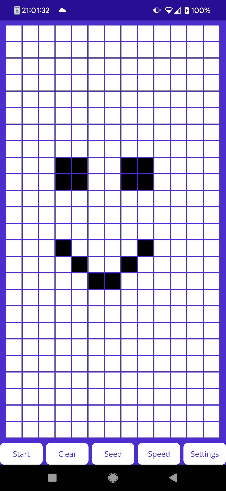
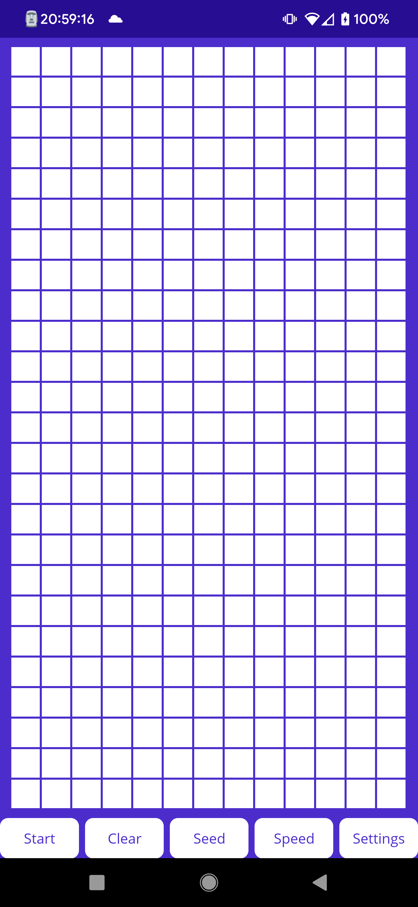
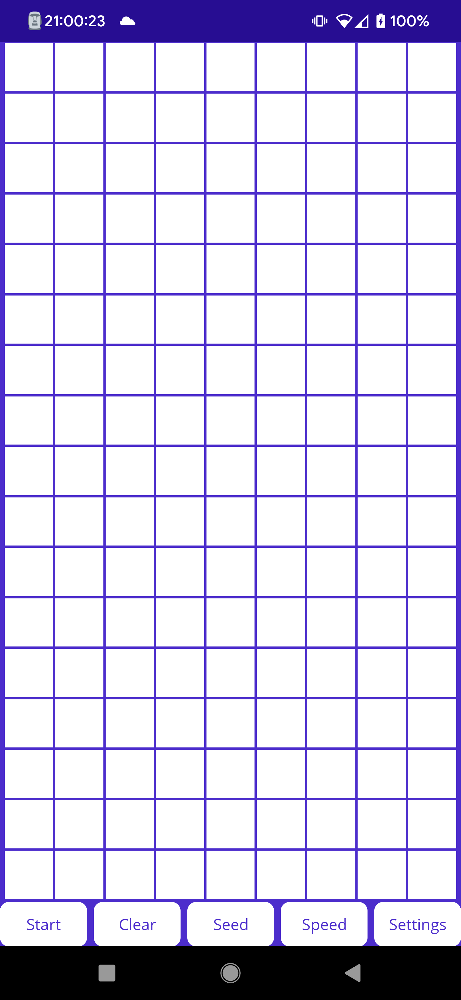
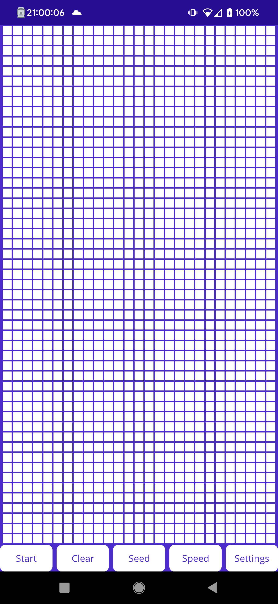

<h1>GameOfLifeMaui</h1>

Game of life maui is of course built using MAUI framework. 
This means the app could be run on environments such as: android, ios or windows.
Project aims to implement Convay's Game of Life using visual controls.

<h2>Main functions</h2>
The main functionality is the main screen showing the game cells. Each cell is a `Frame` object.
The cell has 3 states: alive, dead and frozen. 
Dead being the simplest one indicated that the cell is not active and thus is white. 
Alive cell is colored green, which is made darker, eventually black based on its age (number of generation it has been alive). 
Frozen cell is grey. It can be frozen when the user swipes the screen freezing every cell they swipe over.
Frozen cell will not change its color (although it will still be process, which means it can die or be alive without indicating it).
When the user ends the swipe cell will immediately turn alive and get colored black (max age).

<h2>Application architecture</h2>
Application itself is split into 2 layers: user interact and logic.
User interacts are represented by Pages (most notably `MainPage` and `SettingsPage`). They consist of the layout file (xaml) and the code backing that file (xaml.cs). 
Logic layer is represented by the `GameOfLife.cs` holding the `Game` class.
The class itself aggregates `Cell`s and manages them. It is responsible for drawing and redrawing the game board, which does include updating it.
During the `SizeChanged` event it is responsible for calculating cells and redrawing the board. On top of that it is optimized to not regenerate cell and reuse those that it can, generating (or removing) additional cells. 
The application currently implements two pages: main page (where the game board is drawn) and settings page. 
Main page allows user to interact directly with the board, start or pause the game, seed the board, change tick speed or go to settings. 
Settings currently allow user to change the cell size, effectively increasing or decreasing the cells on the board. This setting is limited to minimal value 12 due to performance reasons.

Board set to 30px cell size (default).

Board set to 45 px cell size.

Board set to 15 px cell size.

The application also includes two static helpers: `SettingsManager` - holding the settings and `PanGestureHandler` which handles the PanGesture, resolves cells and updates them.

<h2>User interaction and its issues</h2>
Game enables user to interact with board, even during normal processing. 
User can interact either by tapping the cell changing it's state or by swiping across the screen. 
The tapping itself causes no problems and is easy enough, so it doesn't need further explanation. 
The swiping is implemented by swipe gesture handler. Unfortunately the handler is imperfect for the job.
The biggest issue is that it doesn't tell you your initial position, like the tap does! 
In short it means we have to approximate the cell based on the cell that started the pan (+- translation).
In practice it will mean the swiping will be slightly inaccurate. The effect is most visible when changing cell size to something small.
Hopefully `CommunityToolkit.Maui` will soon implement TouchEffects from xamarin! (https://github.com/CommunityToolkit/Maui/issues/86)
